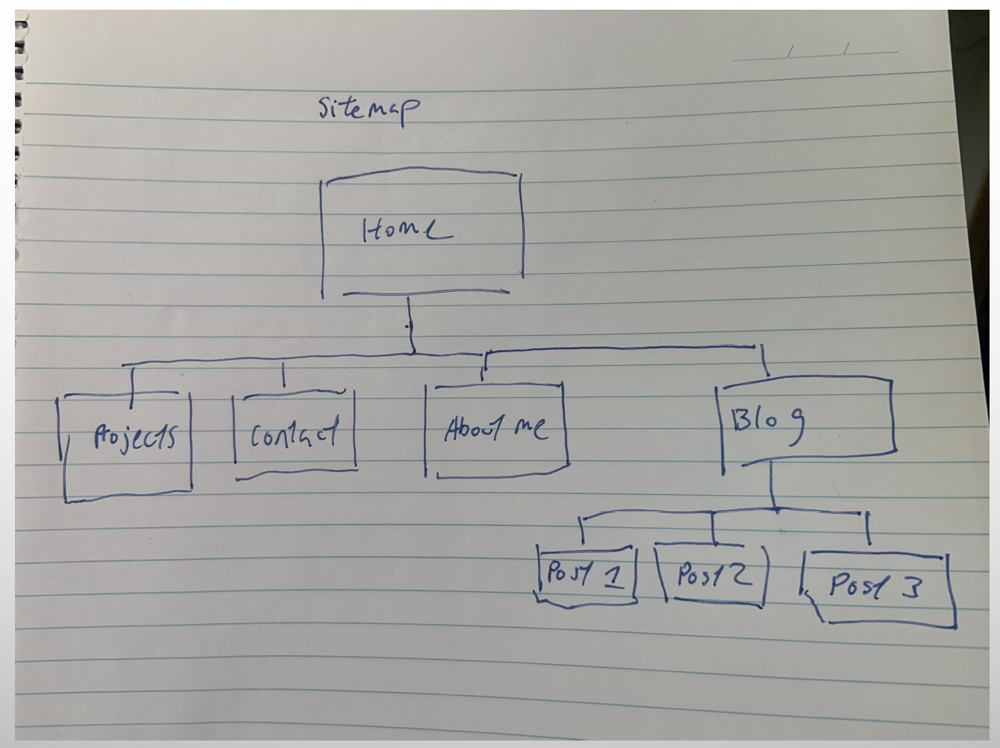
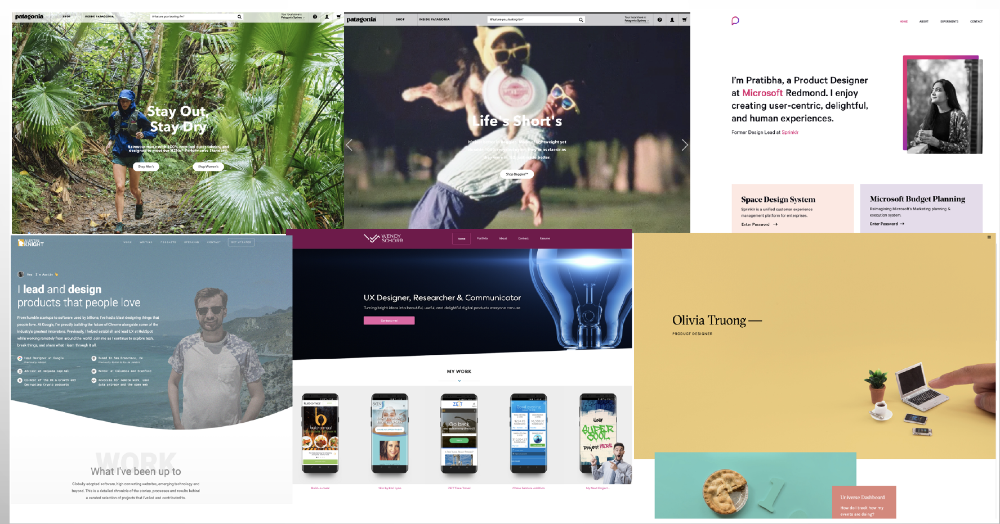
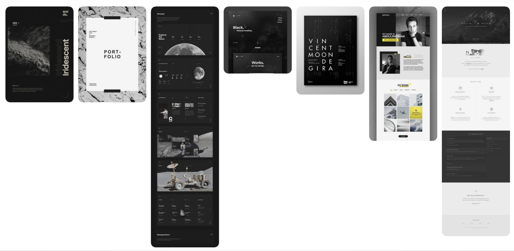
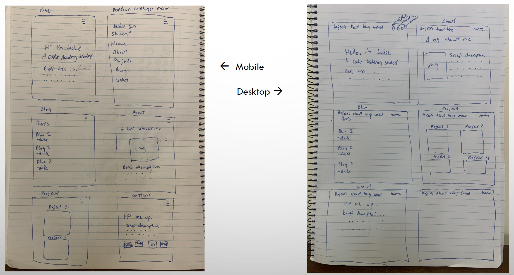
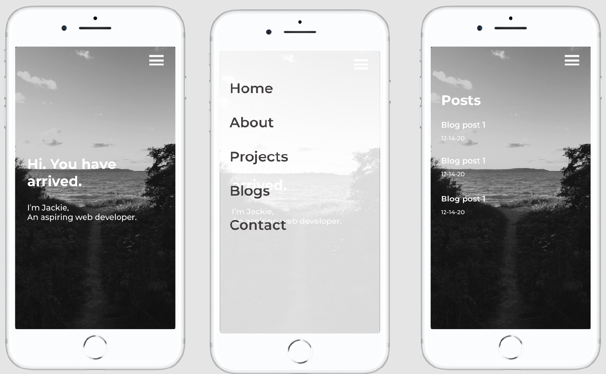
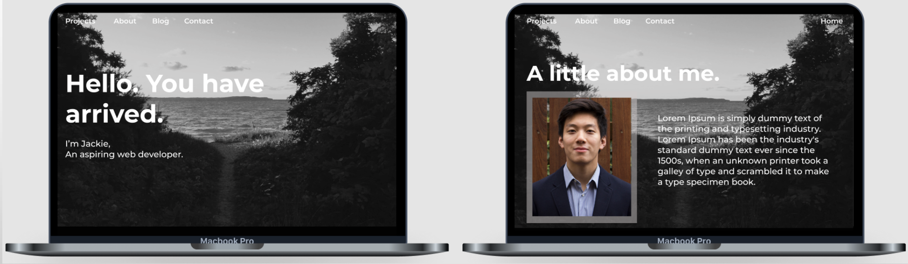

# Portfolio Website

Link to website: https://jackiesun.netlify.app/

## Purpose

The purposes of this portfolio website is to let friends, recruiters and other developers to get to know me a bit more and keep up to date with my projects and blogs. This website also showcases my HTML and CSS skills.

## Functionality and Features

This portfolio page consists of four pages. This includes: a home page, blog page, projects page and contact page.

#### Responsiveness

The portfolio website is fully responsive, the content on all pages is legible regardless of screen size. The content responds accordingly to the users' behavior and environment based on screen size and platform.

#### Navigation for Mobile and Desktop

The website has a navigation bar across the top of the screen for all pages, and provides easy access to other pages of the website. The navigation bar also provides access to my LinkedIn and GitHub. Users can use these social links to contact me or access my work files. On mobile devices, the navigation bar turns into a hamburger menu for easier readability and navigation.

#### Accessibility

The website uses semantic HTML to improve its accessibility. Rather than using divs and spans, the website ultilises main, article and section tags. Furthermore, img tags have alternate text to provide individuals' who are using screen readers to identify the image.

#### SRI Integrity

The HTML document on all pages contain a Sub Resource Integrity (SRI) check. This provides a security check for the integrity of the CSS and JavaScript files that have been used in the document. This was implemented using a sha384 hash. In doing so, the web browser will hash the css file and compare it with the key provided in the HTML document. If there is a slight difference in the key, the CSS and JavaScript will not load and the integrity of the file has not been met.

## Design Process

#### Sitemap

I drew a sitemap to map out the different pages that I wanted to have in my portfolio website. This provided be clarity and gave me structure on how I would arrange my pages.

#### Inspirations

To find some inspiration, I researched a few different brands that I liked. I also looked up different portfolio websites of web developers and ux designers to find common themes that I liked. I liked that some websites incorporated a heading that matched the theme of their background image. I felt like this was something I wanted to incorporate in my portfolio website.

After doing some research, I designed a mood board on Pinterest with common themes that I liked. I decided I wanted a dark grey theme with white text.

#### Wireframes

I drew out my low fidelity wireframes on a piece of paper. I did because it was a faster solution to create the bare bones structure of the website. I designed the mobile wireframes first then moved onto the desktop wireframes.

Once I finished the low fidelity wireframes, I moved onto the high fidelity wireframes. I used Figma to build this as it provided a more realistic view of how the website will look once it was completed. I incorporated a picture of a path with trees and a beach, with the caption "You have arrived". This was to simulate the experience of finally arriving at the beach after walking on a sandy path, but instead of arriving at the beach you have arrived to my portfolio website.

Once i designed the mobile wireframes, I moved onto the desktop wireframes.

## Target Audience

This website was designed for recruiters, employers, friends and the developer community. This website shows my technical skills as well as a bit about myself and my personality.

## Tech Stack

These are the technologies I used for the website:

- HTML
- CSS
- JavaScript
- Git and Github for version control
- Netlify for hosting and deployment
